---
tags:
  - hardware
  - keyboard
  - music
date: 2011-06-18
---

# Open heart surgery on a Fatar StdioLogic SL880

This one is for all of you who have a Fatar keyboard of version StudioLogic SL880 or similar ones. If one of your keys stops working and slumps down it may be that an inner plastic has broken in which case you will need to either send it to the shop or do surgery on it. This one is for the brave of heart who want to take the surgery road. Why should you do it? Because you are brave, because you don't want to haul the heavy keyboard to an expensive lab to fix it for lots of money. In any case the idea is to get a plastic from one of the unused keys (I used the lowest notes) and put it instead of the broken one on the broken notes. One piece of advice: **no fear - and read the entire guide before starting!**. Photos were taken using my iPhone and you can click on them to get a more detailed image.

Here are the stages:

First gut out the keyboard. You'll have to open 6 deep screws (hidden in trenches), 3 on either side at the bottom of the case. It's hard but it's doable. I have also released 6 more screws at the bottom and gutted the keyboard totally. You really don't have to do that but I wanted to clean the inside while I'm at it.

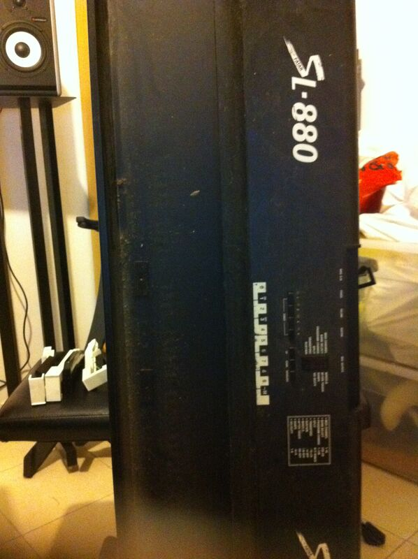

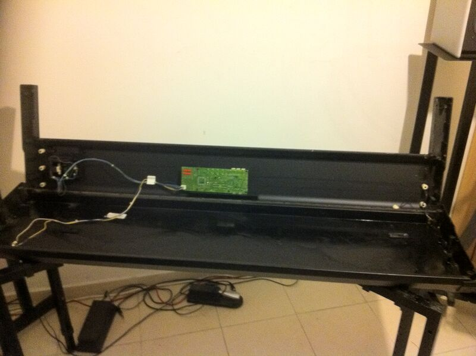

Now find the key(s) that cause(d) the problem. You need to use a small flat screwdriver in order to free the keys. Just insert the screwdriver into the back of the key and press on the small plastic. Once it's pushed the key could be pulled upwards and released. You will now see the problem.

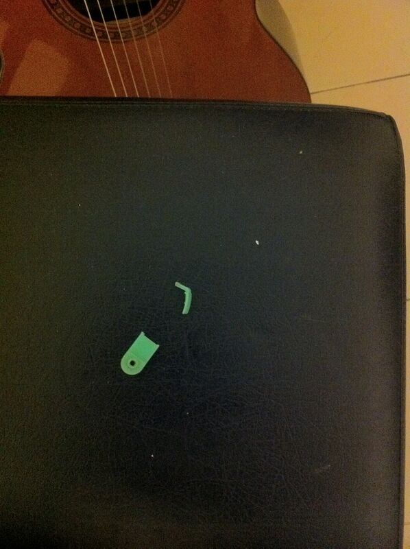

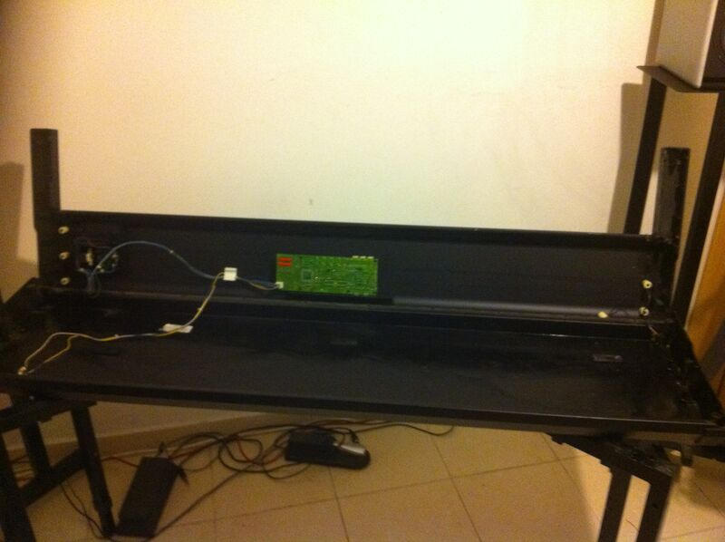

In order to fix the problem you will have to **release all keys!**. Yes - I know this hurts but there is a long steel rod that runs through all of them. As long as the keys are clicked into place they apply pressure on the rod and you will not be able to pull it out or, if you happen to pull it out, to get it back in again. So, release all the keys with the screw driver as before. You can either put them on the side or keep them in their place. I started with the former and ended up with the latter since it is better. Since you will be releasing all the keys this is your chance to clean the keys as well.

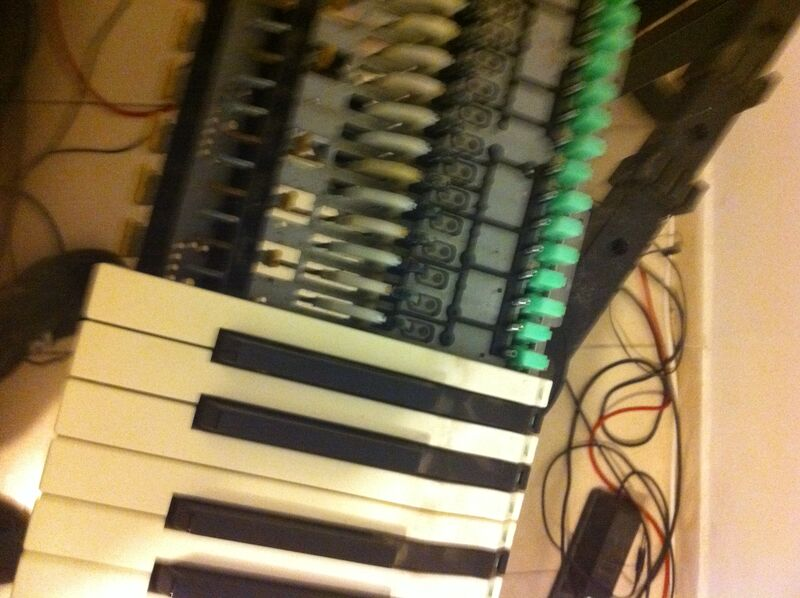

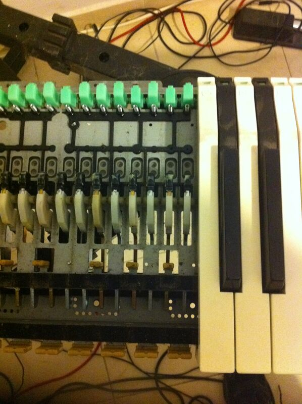

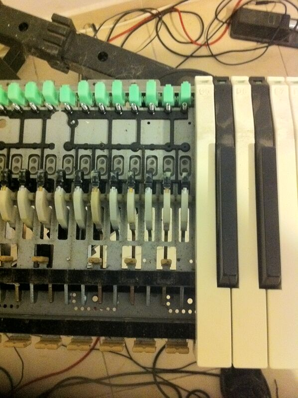

During the whole process watch out for the small springs. Each key has one and the spring is not held by anything once you release the keys...

Now you will get to a situation where there is no iron bar for the key you want to work on...

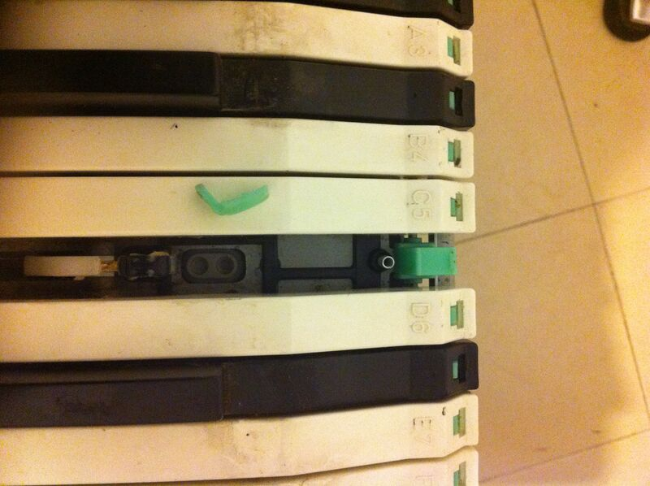

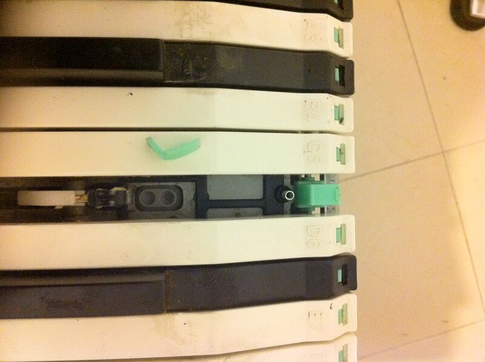

Get the bad plastic out and put in a good piece of plastic from an unused key. I used the bottom most notes.

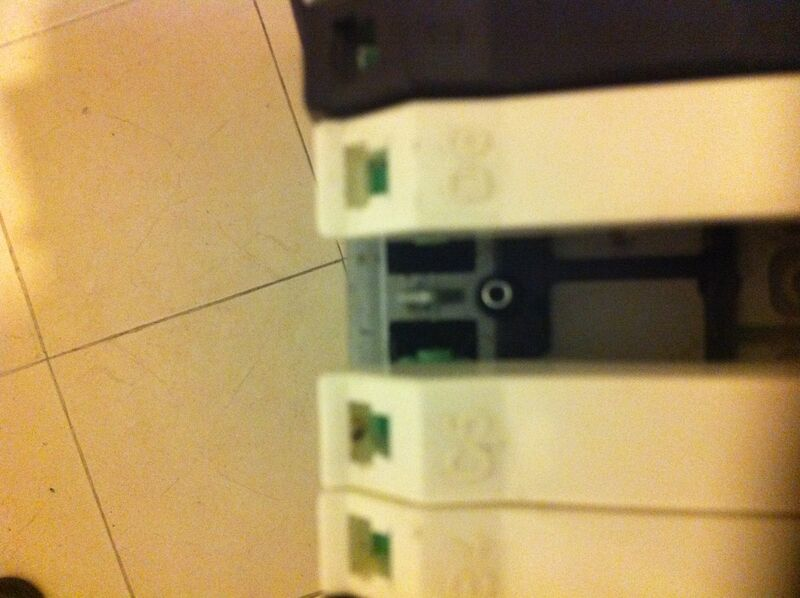

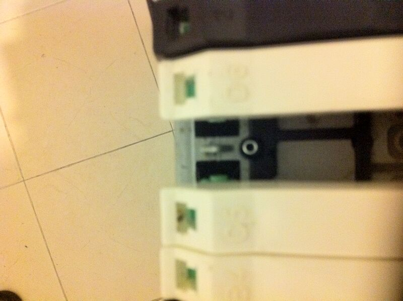

Some keys on the side. I pulled out a couple only to realize that it is better to keep them in place to avoid having to reconstruct exactly where each key goes. In any case, if you do pull them out, it is not a big deal since the keys are all numbered. White keys are "A B C D E F G" and black ones are numbered "1 2 3 4 5" and stand for C#, D#, F#/Gb, Ab, Bb. It looks like the black keys are interchangeable so you their numbers are not as important as those of the white keys. The ends of the keyboard have special keys. Keep an eye on those.

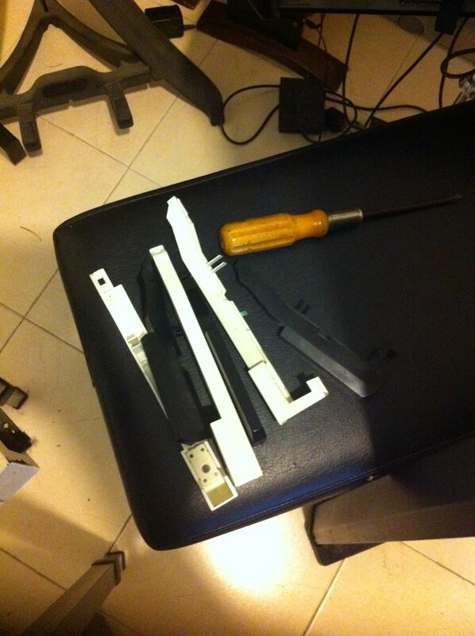

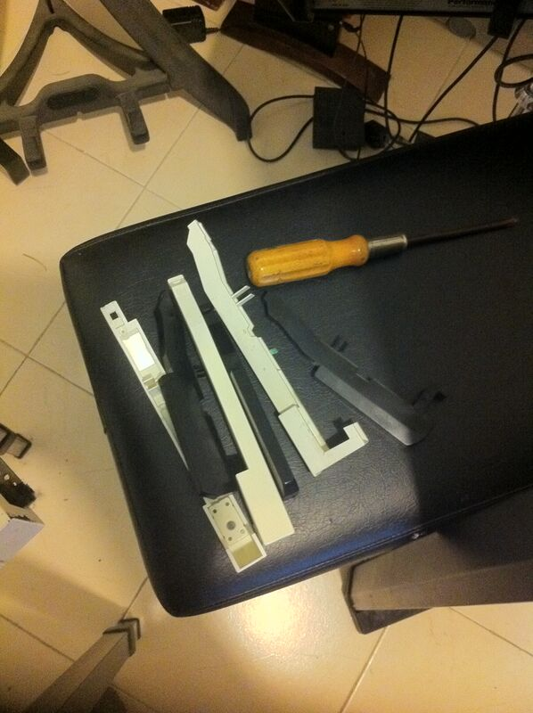

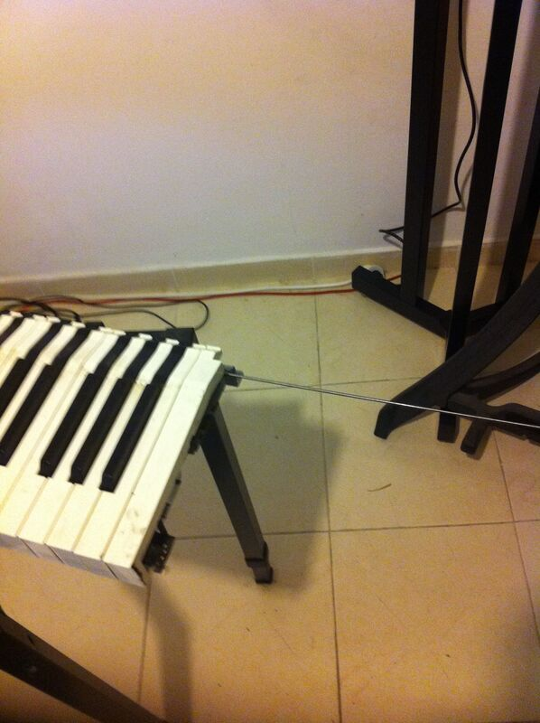

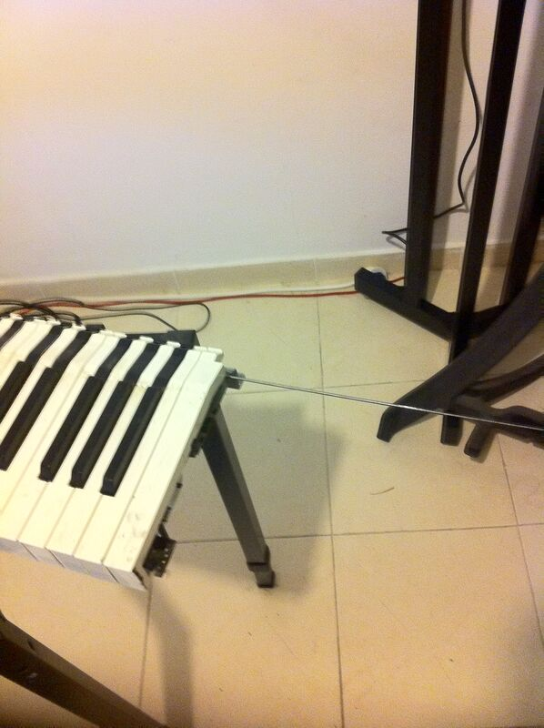

If you do decide to gut out the keyboard completely by removing the extra set of 6 screws at the bottom then you will be able to clean the case itself. If you decide on this remember to release the keyboard only after you disengage the 4 data cables (two fat, two thin) that connect the keyboard to the case. Here is an image of the case after the cleanup...

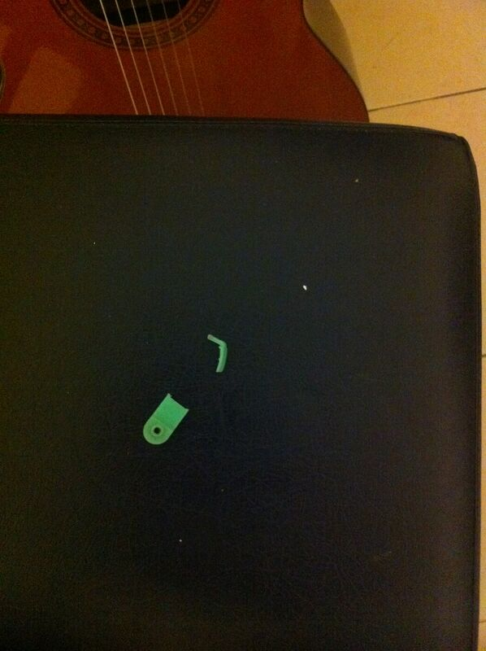

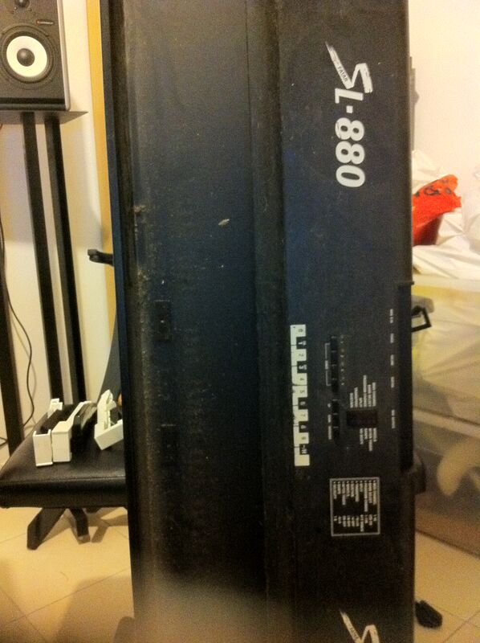

The whole procedure took me about 3 hours and some. Well worth it.

more links about Fatar fixes:
[bad sounds](https://web.archive.org/web/20110415070239/http://www.keyboardforums.com/repaired-my-fatar-studiologic-sl-880-a-t18433.html)
electronics (original link dead)
hardware issues (original link dead)

The official owners guide (from my site):
fatar-sl880.pdf

Reviews of the Fatar SL-880:
Harmony Central (original link dead)
